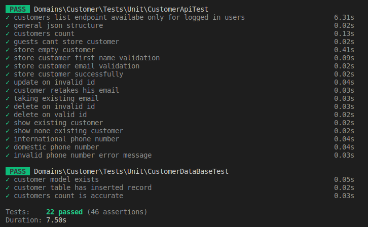

# Laravel CRUD Test Assignment
In this repo I tried to present my skills, specially In the backend field (believe me I am enough for the frontend as well 😄), below you may see the results of the task:


## RESULTS
| # 	| Description                                      	| Status 	|
|---	|--------------------------------------------------	|--------	|
| 1 	| TDD                                              	| Done ✅ 	|
| 2 	| DDD                                              	| Done ✅ 	|
| 3 	| BDD                                              	| Done ✅ 	|
| 4 	| Clean architecture                               	| Done ✅ 	|
| 5 	| CQRS pattern (Event sourcing).                   	| UnResolved 😐 	|
| 6 	| Clean git commits that shows your work progress. 	| Done ✅ 	|
| 7 	| Use PHP 8.2.x only                               	| Done ✅ 	|
| 8 	| During Create; validate the phone number to be a valid mobile number only                       	| Done ✅ 	|
| 9 	| Use Google LibPhoneNumber to validate number at the backend                                     	| Done ✅ 	|
| 10 	| A Valid email and a valid bank account number must be checked before submitting the form        	| Done ✅ 	|
| 11 	| Customers must be unique in database: By ```Firstname```, ```Lastname``` and ```DateOfBirth```. 	| Done ✅ 	|
| 12 	| Email must be unique in the database.                                                           	| Done ✅ 	|
| 13 	| Store the phone number in a database with minimized space storage                               	| Done ✅ 	|
| 14 	| clone the repository in a new github repository in private mode 	| Done ✅     	|
| 15 	| share with ID: ```mason-chase``` in private mode on github.com  	| Done ✅     	|
| 16 	| make sure you do not erase my commits and then                  	| Done ✅     	|
| 17 	| create a pull request (code review)                             	| Done ✅ 	|
| 18 	| Docker-compose project that loads database service automatically with ```docker-compose up``` 	| Done ✅ 	|
| 19 	| Web UI      	| UnResolved 😐 	|
| 20 	| Swagger     	| Done ✅ 	|

* **Note** that ```OpenApi 3``` is used to document the api.
* Some extensive researches are made to find the best choices for today and tomorrow needs. You may see the references in the **NOTES** section of [todos](./todos.md). 

## TEST RESULTS
During the project different aspects of the project is tested and below you may see the test results.



## API documentations
The api docs are present in ```OpenAPI 3``` which is kinda new version of swagger. you may see the results in the [api.yml](./Domains/Customer/docs/api.yml) file.

## Steps
The steps that I followed to do the project is available in [steps.md](./Domains/Customer/docs/Steps.md). The file shows how I approach a software development project. 

## Usage
A concise document about how to use this repo is available in [usage.md](./Domains/Customer/docs/usage.md) file.
But for short you can follow below commands to run the project:
```bash
  # for the first time use 
  docker-compose build
  # then run up -d run containers in a dispatched mode
  docker-compose up -d
```
* It is obvious that you need docker installed on your machine.

## Services and specifications
As was required in the project, ```php 8.2``` is used as programming language. Also ```mariadb``` is applied as the database. 

**Thanks for the time, Regards Ali**